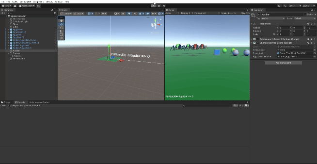
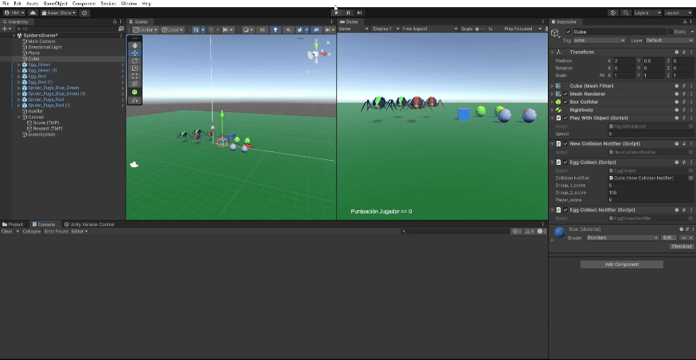
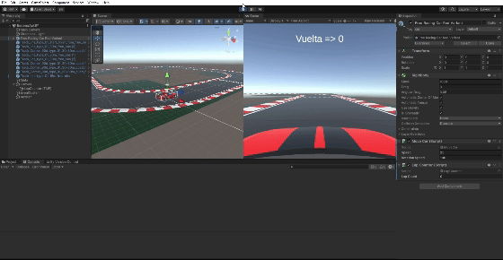
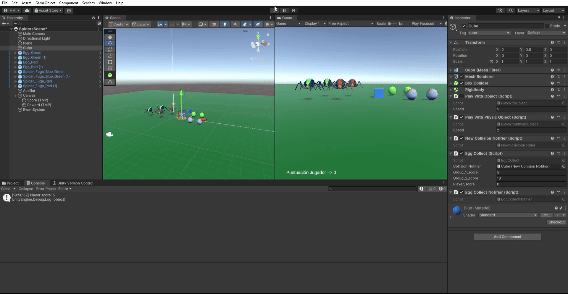

# Interfaces Inteligentes

- Hugo Hernández Martín (alu0101481227@ull.edu.es)

# Práctica 4: Introducción a los Eventos. Patrón Observador.

## Actividad 1

Se ha creado una escena en la que se añade un cubo cinemático, un cilindro físico perfecto y dos grupos de dos esferas (todas ellas físicas perfectas). El cubo se puede controlar mediante las teclas aswd o las flechas. Cuando el cubo choca contra el cilindro (***onCollisionEnter***), las esferas del grupo 2 se desplazan hacia el cilindro y las del grupo 1 hacia la posición media de las del grupo dos (se toma la posición de ambas esferas del grupo 1, se suman y se divide entre dos). Es importante destacar que las esferas han de ser movidas mediante fuerzas, ya que son físicas perfectas. Por último, se ha implementado mediante un patrón observador (el cilindro es el notificador que detecta la colisión con el cubo y las esferas son los suscriptores, que reaccionan cuando reciben el evento).

* Esferas Grupo 1 (color amarillo).
* Esferas Grupo 2 (color naranja).

[Enlace al Script de movimiento del cubo.](./Scripts/PlayWithObject.cs)

[Enlace al Script Notificador.](./Scripts/CollisionNotifier.cs)

[Enlace al Script esferas grupo 1.](./Scripts/MoveToGroup2SpheresWhenCubeCollision.cs)

[Enlace al Script esferas grupo 2.](./Scripts/MoveToCylinderWhenCubeCollision.cs)

## Actividad 2

Se sustituyen las esferas y los cilindros por arañas y huevos de arañas respectivamente. Se añade un huevo para que haya uno de cada tipo de araña.

## Actividad 3

Tras cambiar la escena, se mantiene el Script del movimiento del cubo. Se genera un nuevo Script notificador (que se asocia al cubo) que lanzará diferentes eventos (uno relacionado con la colision del cubo con las arañas del grupo 1 y otro para las colisiones con las arañas del grupo 2). Las arañas de tipo 1 implementan un Script que modifica su ejecucion según si el cubo se choca con las arañas de tipo 1 (arañas de tipo 1 van hacia el huevo de tipo 2) o con las arañas de tipo 2 (arañas de tipo 1 van hacia el huevo de tipo 1). Por último, se ha creado un Script asociado a los huevos en el que, si se detecta una colisión con algún tipo de araña, se cambia el color del propio huevo por uno aleatorio.

[Enlace al Script de movimiento del cubo.](./Scripts/PlayWithObject.cs)

[Enlace al Script Notificador del cubo.](./Scripts/NewCollisionNotifier.cs)

[Enlace al Script de las Arañas de tipo 1.](./Scripts/Group1SpidersMoveTo.cs)

[Enlace al Script de cambio de color de los huevos.](./Scripts/ChangeEggWhenSpiderCollides.cs)

## Actividad 4

En la actividad se solicita que, al colisionar con los huevos de tipo 1, las arañas de tipo 1 se teletransporten hacia un objeto (se ha elegido el primer huevo de tipo 1) y que las arañas de tipo 2 miren hacia otro objeto (se ha seleccionado el primer huevo de tipo 2). Para la implementación se ha añadido al Script Notificador del cubo un evento que notifica las colisiones con los huevos de tipo 1. Al Script de las arañas de tipo 1 se le ha añadido una suscripción a este evento que hace que las arañas se trasladen (para permitir la teletransportación hay que activar momentáneamente que sean cinemáticas, ya que son físicas perfectas). Se crea un Script que se suscribe al evento de colisión con el huevo de tipo 1 y que se añade a las arañas de tipo 2, éste se encarga de rotar las arañas haciendo uso del método de rigidBody **MoveRotation*** y como parámetro usando el método ***Quaternion.LookRotation***.

Como curiosidad, para evitar que las arañas caigan encima del huevo o encima una de la otra en la teletrasportación, se ha usado una variable estática privada en el Script de las arañas de tipo 1 (`spiders_counter`) que se aumenta cada vez que se realiza una teletrasportación (y se resetea cuando es mayor o igual que el número). Ésta variable se usa para obtener la posición objetivo de las arañas (dependiente de la variable `spiders_counter`).

[Enlace al Script Notificador del cubo actualizado.](./Scripts/NewCollisionNotifier_act_04.cs)

[Enlace al Script de las Arañas de tipo 1 actualizado.](./Scripts/Group1SpidersMoveTo_act_04.cs)

[Enlace al Script de las Arañas de tipo 2.](./Scripts/Group2SpidersLookAt.cs)

## Actividad 5

Para la implementación de la mecánica se ha modificado ligeramente el notificador del cubo ya existente y se ha creado otro (con un delegado diferente, que recibe como parámetro el objeto con el que colisiona el cubo).
En primer lugar, se crea un nuevo Script adicionado al cubo que implementa la mecánica de los puntos (5 puntos al colisionar con huevos del tipo 1 y 10 puntos al colisionar con huevos del tipo 2) que es suscriptor del notificador de las actividades anteriores modificado. Por otra parte, se adiciona el nuevo notificador al cubo y se crea un Script que se añade a todos los huevos. El Script que se añade a todos los huevos se suscribe al nuevo notificador y cuando se produce una colisión con algún huevo, traslada el huevo con el que colisionó el cubo de posición para continuar con el juego (como los huevos son físicos, hay que transformarlos a cinemáticos momentáneamente para poder teletransportarlos).

[Enlace al Script Notificador del cubo actualizado.](./Scripts/NewCollisionNotifier_act_05.cs)

[Enlace al Script del nuevo Notificador.](./Scripts/EggCollectNotifier.cs)

[Enlace al Script de la mecánica.](./Scripts/EggCollect.cs)

[Enlace al Script de teletransportación de huevos.](./Scripts/TeleportCollectedEgg.cs)

## Actividad 6

Se ha añadido un Canvas y un objeto hijo del mismo del tipo TextMeshPro. Se ha añadido a un objeto un Script que, al recibir una notificación del Script de la mecánica del juego (ligeramente modificado) actualiza el valor del texto.

[Enlace al Script de la mecánica modificado.](./Scripts/EggCollect_act_06.cs)

[Enlace al Script que actualiza el valor del texto.](./Scripts/ChangeCanvasScore.cs)

## Actividad 7

Se añade al script de la mecánica del juego un evento cuando el jugador obtiene 100 puntos (y multiplos de 100 diferentes de 0). Se añade una recompensa en la UI. La recompensa es un texto que se muestra durante 2 segundos. Se modifica el Script de la mecánica para que notifique cuando la puntuación del jugador cumple la condición dada. Se añade un suscriptor que deja ver la recompensa durante dos segundos, para ello se hace uso de una corrutina.

[Enlace al Script de la mecánica modificado.](./Scripts/EggCollect_act_07.cs)

[Enlace al Script que muestra la recompensa.](./Scripts/ShowReward.cs)

## Actividad 8

Se han aplicado los conocimientos adquiridos hasta ahora para implementar un sencillo simulador de un circuito. Se ha creado una escena con diferentes assets obtenidos en la asset store (coche, que será un elemento cinemático, y trozos de pista). Se ha añadido un elemento auxiliar (con collider trigger) en la meta y un canvas con un texto que muestra la vuelta en la que nos encontramos. Al pasar por la línea de meta se actualiza el contador de vueltas. Se han implementado tres Scripts, uno que se encarga del movimiento del coche y de la cámara, otro que se encarga de manejar la dinámica (contar vueltas y lanzar un evento cuando se cambie de vuelta) y un último que se encarga de actualizar el texto del canvas. A continuación se muestra un GIF del simulador en funcionamiento:

[Enlace al Script de movimiento del coche y cámara.]()

[Enlace al Script de dinámica del juego.]()

[Enlace al Script suscriptor que actualiza el número de vuelta.]()

## Actividad 9

Se ha cambiado el Script de movimiento del cubo de la actividad 3 por uno en el que se mueva mediante fuerzas (ya que ahora es un cubo físico). Además, se observa en el GIF que ahora lo que cambia de color al chocar con los huevos de tipo 1 no son los huevos, son las arañas.

[Enlace al Script de movimiento del cubo físico.](./Scripts/PlayWithPhysicObject.cs)